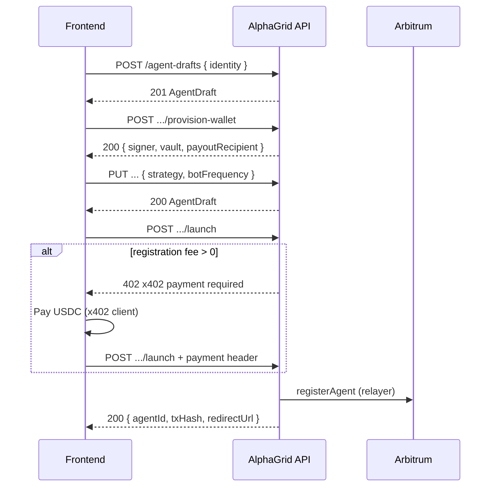

# Frontend Integration — Agent Launch Wizard

Guide for wiring the **agent launch wizard** in the AlphaGrid web app against the HTTP API.

**OpenAPI:** `GET /docs/swagger.json` (tag `Agent drafts`)  
**Related:** [Privy auth](../api/README.md#privy-auth), [Agent launch drafts](../api/README.md#agent-launch-drafts-d1--privy), [Dashboard stats](./10_frontend_integration.md)

---

## 1. Overview

The launch wizard is **off-chain** until the user clicks Launch. The API stores draft state in D1 per chain. The frontend owns step order and UI; the API only checks that required fields are present at launch.

| Role | Address |
| --- | --- |
| **Owner** | User’s Privy-linked Ethereum wallet (pays x402 registration fee, receives payouts) |
| **Signer** | Custodial key generated by the API (signs trades server-side; private key never sent to the client) |
| **Vault** | Genesis vault for the chain (set automatically on wallet provision) |

**No wallet signature popup at launch** — the API signs `SelfRegister` with the custodial signer and relays registration. The user may pay a USDC registration fee via **x402** when the on-chain fee is non-zero.

---

## 2. Base URL

Pick the API Worker for the chain the app is on:

| Environment | Base URL | Chain ID |
| --- | --- | --- |
| Arbitrum Sepolia (dev/test) | `https://api-421614.alphagrid.capital` | `421614` |
| Robinhood testnet | `https://api-46630.alphagrid.capital` | `46630` |
| Arbitrum One | `https://api-42161.alphagrid.capital` | `42161` |
| Local | `http://localhost:8787` | from Wrangler env |

Drafts are **per-chain**. Use the matching API base URL for the chain the user selected in the app.

---

## 3. Authentication (required on every draft route)

All agent-draft endpoints require a Privy session. Login via `@privy-io/react-auth` (or `@privy-io/js`).

### Headers

Every request must include:

```http
Authorization: Bearer <access_token>
privy-id-token: <identity_token>
Content-Type: application/json
```

Obtain tokens from the Privy SDK after login:

```ts
const accessToken = await getAccessToken()
const identityToken = await getIdentityToken()
```

If either header is missing → **401** `{ "error": "Unauthorized" }`.  
If tokens are invalid → **401** `{ "error": "Unauthorized" }`.

### Helper

```ts
const API_BASE = import.meta.env.VITE_API_BASE_URL // e.g. https://api-421614.alphagrid.capital

async function apiFetch(path: string, init: RequestInit = {}) {
  const accessToken = await getAccessToken()
  const identityToken = await getIdentityToken()
  if (!accessToken || !identityToken) {
    throw new Error('Not authenticated')
  }

  return fetch(`${API_BASE}${path}`, {
    ...init,
    headers: {
      'Content-Type': 'application/json',
      Authorization: `Bearer ${accessToken}`,
      'privy-id-token': identityToken,
      ...init.headers,
    },
  })
}
```

Optional: call `GET /auth/me` on app load to upsert the user profile in D1.

---

## 4. Endpoints

| Method | Path | Purpose |
| --- | --- | --- |
| `POST` | `/agent-drafts` | Create draft with identity |
| `PUT` | `/agent-drafts/{draftId}` | Partial update (`identity`, `strategy`, `botFrequency`) |
| `GET` | `/agent-drafts/{draftId}` | Load one draft (resume) |
| `GET` | `/users/me/agent-drafts` | List in-progress drafts for the wallet |
| `GET` | `/managed-agents/me` | List managed agent profiles (active + archived) |
| `DELETE` | `/agent-drafts/{draftId}` | Abandon draft (wipes custodial key) |
| `POST` | `/agent-drafts/{draftId}/provision-wallet` | Generate custodial signer + bind Genesis vault |
| `POST` | `/agent-drafts/{draftId}/launch` | x402 (if fee > 0) + on-chain register |
| `POST` | `/managed-agents/{agentId}/archive` | Archive managed agent (owner only) |

**Per-user limit:** At most **5 active** (non-archived) managed agents per wallet. Enforced at launch (**400**). Drafts do not count. Check `GET /managed-agents/me` → `activeCount` / `maxAgents` before opening the wizard.

**On-chain list:** `GET /agents/by-owner/{owner}` returns all owned agents (managed + self-registered) with `managed: { isManaged, archivedAt }`.

**Fee preview (optional UI):** `GET /agents/register/quote?signer=0x...` — same registration fee the launch path uses (read `registrationFee` / x402 fields). You do not need the agent signer address for launch; any valid address works for quote if you only need the fee amount.

---

## 5. Types (TypeScript)

```ts
export type BotFrequency = '1h' | '1d'

export interface AgentIdentity {
  name: string
  handle: string // 1–20 chars: a-z, 0-9, hyphen
  description?: string
  links?: {
    x?: string
    github?: string
    website?: string
  }
}

export interface AgentWallet {
  signer: `0x${string}`
  vault: `0x${string}`
  payoutRecipient: `0x${string}`
}

export interface AgentDraft {
  draftId: string // draft_<uuid>
  owner: `0x${string}`
  identity?: AgentIdentity
  wallet: AgentWallet | null
  strategy: string | null
  botFrequency: BotFrequency | null
  createdAt: string // ISO 8601
  updatedAt: string
}

export interface LaunchAgentResponse {
  agentId: string // numeric string, e.g. "42"
  txHash: `0x${string}`
  status: 'pending'
  redirectUrl: string // e.g. "/app/agents/ag_42"
}

export interface AgentProfile {
  agentId: string
  handle: string
  strategy: string
  botFrequency: BotFrequency
  pricingTier: string
  nextRunAt: string
  archivedAt: string | null // null = active
  createdAt: string
}

export interface AgentProfileList {
  agents: AgentProfile[]
  total: number
  activeCount: number
  maxAgents: number // currently 5
}
```

---

## 5b. Agent limits & archive

| Rule | Detail |
| --- | --- |
| Active limit | **5** launched agents per wallet (`maxAgents` on list response) |
| What counts | Non-archived rows in `agent_profiles` (`archivedAt === null`) |
| What does not count | Drafts, archived agents |
| When enforced | `POST .../launch` returns **400** if `activeCount >= maxAgents` |
| Archive | `POST /managed-agents/{agentId}/archive` — on-chain owner only (Privy) |
| Archive effect | Sets `archivedAt`; stops strategy runner; frees a slot; releases handle for reuse |
| On-chain | Archive is **off-chain only** — `GET /agents/{agentId}` still returns the on-chain record |

Archived agents cannot be updated via `PATCH /managed-agents/{agentId}`. Owners can still read on-chain stats, positions, and run history.

```http
GET /managed-agents/me
```

```json
{
  "agents": [
    {
      "agentId": "42",
      "handle": "alpha-bot",
      "strategy": "…",
      "botFrequency": "1h",
      "pricingTier": "free",
      "nextRunAt": "2026-06-24T12:00:00.000Z",
      "archivedAt": null,
      "createdAt": "2026-06-20T10:00:00.000Z"
    }
  ],
  "total": 1,
  "activeCount": 1,
  "maxAgents": 5
}
```

```http
POST /managed-agents/42/archive
```

**200:** `{ "profile": { /* ManagedAgentProfile with archivedAt set */ } }`  
**400:** `Agent is already archived`

For the full on-chain agent list (managed + self-registered), use `GET /agents/by-owner/{owner}` and read each item's `managed` flag.

---

## 6. Recommended flow

The API does **not** assign step numbers. Suggested wizard (adjust freely):



### Minimum data before launch

| Field | How it is set |
| --- | --- |
| `identity` | `POST /agent-drafts` or `PUT` |
| `wallet` | `POST .../provision-wallet` |
| `strategy` | `PUT` |
| `botFrequency` | `PUT` (`1h` or `1d` only) |

If anything is missing → **400** `{ "error": "Draft is incomplete" }`.

---

## 7. Request examples

### Create draft

```http
POST /agent-drafts
```

```json
{
  "identity": {
    "name": "Quantum Hawk",
    "handle": "quantum-hawk",
    "description": "Momentum on large-cap tech",
    "links": {
      "website": "https://example.com"
    }
  }
}
```

**201** — full `AgentDraft` ( `wallet`, `strategy`, and `botFrequency` are null until set).

**400** — `{ "error": "Handle is already taken" }` if another active draft uses the handle.

### Update draft (partial)

```http
PUT /agent-drafts/draft_550e8400-e29b-41d4-a716-446655440000
```

Any combination (at least one field):

```json
{
  "identity": {
    "name": "Quantum Hawk",
    "handle": "quantum-hawk",
    "description": "Updated bio",
    "links": {}
  }
}
```

```json
{
  "strategy": "Buy NVDA on RSI < 30, sell at +5% or stop -2%.",
  "botFrequency": "1h"
}
```

**`botFrequency`:** only `"1h"` or `"1d"`. `"1m"` / `"1s"` → **400** (schema validation).

### Provision wallet

```http
POST /agent-drafts/{draftId}/provision-wallet
```

No body. Idempotent: calling again returns the same addresses if already provisioned.

**200:**

```json
{
  "signer": "0x…",
  "vault": "0x…",
  "payoutRecipient": "0x…"
}
```

`payoutRecipient` is the authenticated owner wallet. `vault` is the chain’s Genesis vault.

Show `signer` and `vault` in review UI if helpful; **never** expect a private key in the response.

### Launch

```http
POST /agent-drafts/{draftId}/launch
```

No body.

**200:**

```json
{
  "agentId": "42",
  "txHash": "0xabc…",
  "status": "pending",
  "redirectUrl": "/app/agents/ag_42"
}
```

- Display agent as `ag_{agentId}` in the UI (`ag_42`).
- Poll `GET /transactions/{txHash}` until `status` is `success` or `reverted`, then navigate to `redirectUrl` or `GET /agents/{agentId}`.
- If **400** `Maximum of 5 active agents per user`, prompt the user to archive a managed agent (`POST /managed-agents/{agentId}/archive`) or review agents via `GET /managed-agents/me` and `GET /agents/by-owner/{owner}`.

### Resume after refresh

```http
GET /users/me/agent-drafts
```

```json
{
  "drafts": [ { /* AgentDraft */ } ],
  "total": 1
}
```

Only drafts with `status === 'draft'` on the server are returned. Pick the latest `updatedAt` or let the user choose.

### Abandon

```http
DELETE /agent-drafts/{draftId}
```

**204** — no body.

---

## 8. x402 registration fee at launch

When `FeeManager.getRegistrationFee() > 0`, `POST .../launch` behaves like `POST /agents/register`:

1. First call without payment → **402** with x402 payment instructions (body + `payment-required` / related headers per [x402](https://x402.org/)).
2. User pays USDC from the **owner** wallet (Privy).
3. Retry the same `POST` with the payment signature header (`payment-signature` or `x402` client helper).

When the on-chain fee is **zero**, launch proceeds without payment (**200** on first call).

**Do not** send a `pricingTier` from the frontend — the API sets `free` / `paid` at launch from the on-chain fee.

Use `GET /agents/register/quote` to show fee amount and token in the review step before launch.

---

## 9. Validation (client-side)

Mirror API rules for better UX:

| Field | Rule |
| --- | --- |
| `identity.name` | 1–128 characters |
| `identity.handle` | `^[a-z0-9-]{1,20}$` |
| `identity.description` | max 2048 characters |
| `identity.links.*` | valid URLs if present |
| `strategy` | 1–8192 characters when set |
| `botFrequency` | `"1h"` or `"1d"` only |

---

## 10. Error handling

| Status | Meaning | Typical `error` |
| --- | --- | --- |
| **400** | Invalid input or incomplete draft | `Draft is incomplete`, `Handle is already taken`, `Maximum of 5 active agents per user`, `Agent is already archived`, Zod message |
| **401** | Missing/invalid Privy session | `Unauthorized` |
| **402** | x402 payment required (launch) | x402 payload |
| **404** | Draft not found or wrong owner | `Agent draft not found` |
| **502** | Chain registration failed | On-chain / relayer message |
| **503** | API misconfigured | `Database not configured`, `RELAYER_PRIVATE_KEY is not configured` |

Errors are JSON: `{ "error": string }` unless x402 returns a structured 402 body.

---

## 11. What goes on-chain vs off-chain

| Data | Stored |
| --- | --- |
| `identity.name` | On-chain agent name |
| `identity.handle`, `description`, `links` | On-chain `metadataURI` (base64 JSON profile) |
| `strategy`, `botFrequency` | Off-chain `agent_profiles`; scheduler uses `next_run_at` after launch |
| Custodial signer key | Encrypted in D1 (`agent_signers`) |

Strategy and bot frequency are **not** in public metadata.

---

## 12. Suggested page wiring

| Screen | API calls |
| --- | --- |
| Wizard entry / resume | `GET /users/me/agent-drafts` |
| Agent list / limit gate | `GET /managed-agents/me` + `GET /agents/by-owner/{owner}` |
| Step: identity | `POST /agent-drafts` or `PUT` with `identity` |
| Step: wallet (auto) | `POST .../provision-wallet` on entering step or before review |
| Step: strategy & frequency | `PUT` with `strategy`, `botFrequency` |
| Review | `GET /agent-drafts/{id}` + optional `GET /agents/register/quote` for fee |
| Launch | `POST .../launch` (+ x402 retry) |
| After launch | `GET /transactions/{txHash}` → redirect to `redirectUrl`; optional `GET /agents/{agentId}/strategy-runs` for run history |
| Archive agent | `POST /managed-agents/{agentId}/archive` |
| Cancel wizard | `DELETE /agent-drafts/{id}` |

Persist `draftId` in the route query (`?draft=draft_…`) or app state so refresh can call `GET /agent-drafts/{draftId}`.

---

## 13. Out of scope (do not wire yet)

| Feature | Notes |
| --- | --- |
| ERC-8004 in wizard | Not in launch API; link later via `POST /agents/{id}/erc8004/link` |
| User EIP-712 sign at launch | Custodial signer only |
| `pricingTier` in UI | Derived server-side from registration fee |
| Strategy execution / cron | **Partial** — cron runs every 10 min; `decideStrategy` is a stub (hold, no trades); owners can update future runs via `PATCH /managed-agents/{agentId}` and view run history via `GET /agents/{agentId}/strategy-runs`. Do not promise autonomous trading in UI yet. |
| IPFS `metadataURI` | API uses `data:application/json;base64,…` for now |

---

## 14. Checklist

- [ ] Privy login; both tokens on every draft request
- [ ] API base URL matches selected chain
- [ ] Create draft → provision wallet → PUT strategy + `botFrequency` → launch
- [ ] Handle **402** on launch when fee > 0
- [ ] Show `ag_{agentId}`; poll tx status before success UI
- [ ] Resume via `GET /users/me/agent-drafts` or stored `draftId`
- [ ] Gate new launches on `GET /managed-agents/me` (`activeCount < maxAgents`)
- [ ] Wire archive action (`POST /managed-agents/{agentId}/archive`)
- [ ] Client validation for handle, strategy length, `botFrequency` enum
